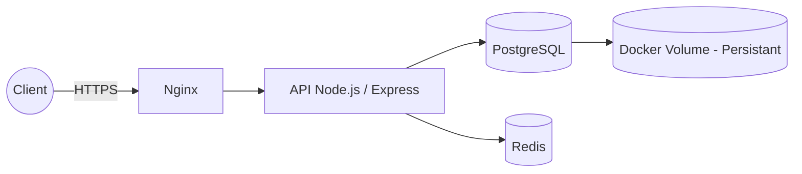
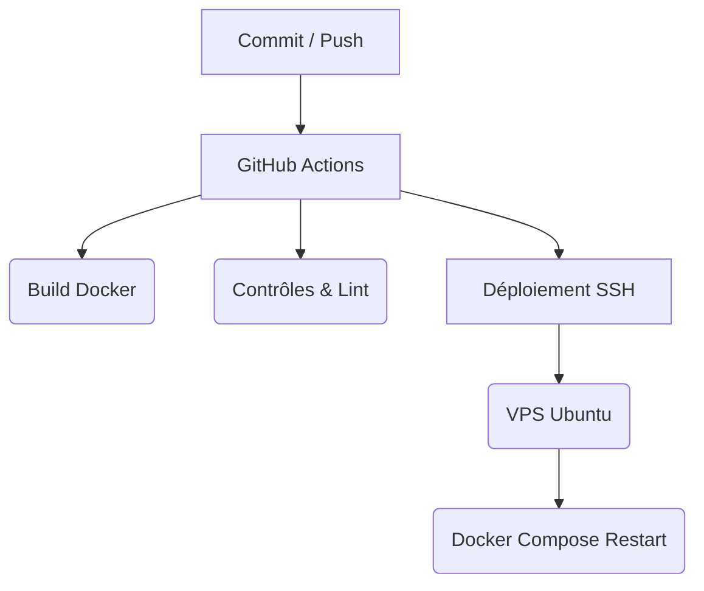

# 🚀 API e-Commerce – Projet d’Examen DWWM

API e-commerce moderne, sécurisée, performante et déployée de manière professionnelle via Docker, Nginx et GitHub Actions. Projet complet démontrant l’ensemble des compétences attendues du Titre Professionnel **Développeur Web & Web Mobile (DWWM)**.

---

## 🌈 Badges Colorés


---

# 🎯 Objectif du Projet

Créer une **API REST professionnelle**, conforme aux exigences DWWM :

* Architecture **MVC** claire et scalable
* Authentification sécurisée (**JWT**, **Bcrypt**)
* Gestion des rôles (**user/admin**)
* CRUD complet (produits, commandes)
* Base de données **PostgreSQL persistante**
* Cache & panier avec **Redis**
* Déploiement **VPS + Docker + Nginx + HTTPS**
* Pipeline **CI/CD avec GitHub Actions**
* Sécurité API et bonnes pratiques DevOps

---

# 🧩 Stack Technique

## Backend

* Node.js
* Express.js
* JWT
* Bcrypt
* Cookie-parser
* CORS
* Helmet

## Base SQL

* PostgreSQL
* Extensions : `uuid-ossp`, `pgcrypto`
* MCD / MLD / MPD

## Système & Infra

* Docker
* Docker Compose
* Redis
* Nginx (Reverse Proxy + HTTPS)
* Certbot / Let’s Encrypt
* GitHub Actions (CI/CD)
* VPS Ubuntu 22.04

---

# 🏗 Architecture MVC

```
/src
├── controllers
├── models
├── routes
├── middlewares
└── utils
```

---

# 📊 Diagramme d’Architecture (Mermaid)



---

# 🛠️ Étapes de Construction du Projet

## 1️⃣ Initialisation du Backend

* Création du projet Express
* Architecture MVC
* Variables d’environnement `.env`
* Services Docker : API / PostgreSQL / Redis

## 2️⃣ Authentification Sécurisée

* Inscription → hash **Bcrypt**
* Connexion → **JWT signé**
* Cookies sécurisés : HTTPOnly, SameSite, Secure
* Middleware de validation JWT
* Rôle utilisateur : `user` / `admin`

## 3️⃣ CRUD Produits

* Lecture publique
* Création / modification / suppression pour admin

## 4️⃣ Commandes

* Création de commandes
* Association produits ↔ commandes
* Décrémentation du stock

## 5️⃣ Redis (Panier)

* Stockage du panier
* Calcul du total
* Optimisation performance

---

# 🐳 Docker & Infrastructure

## Services Docker

* API Node.js
* PostgreSQL (volume persistant)
* Redis
* Réseau interne Docker

## Nginx

* Reverse Proxy
* HTTPS avec Let’s Encrypt
* Redirection vers API interne

---

# 🌐 Déploiement VPS Ubuntu

* Installation Docker & Docker Compose
* Clonage du projet
* Configuration Nginx
* Certificats HTTPS
* Mise en production via :

```
docker compose up -d --build
```

---

# ⚡ CI/CD – GitHub Actions

## Pipeline visuel



## Badge CI/CD (une fois le workflow créé)

```

```

---

# ✔️ Résultat Final

* API **sécurisée** (JWT, rôles, cookies protégés)
* Architecture **modulaire** (MVC)
* Système **scalable** (Docker, Redis, Nginx)
* Données **persistantes** (PostgreSQL)
* Pipeline **CI/CD** automatisé
* Déploiement **professionnel** sur VPS
* Conforme **DWWM**

---

# 👤 Auteur

**Antoine Lelièvre** – Développeur Web & Web Mobile
